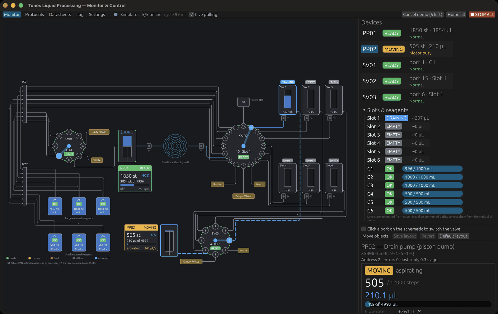
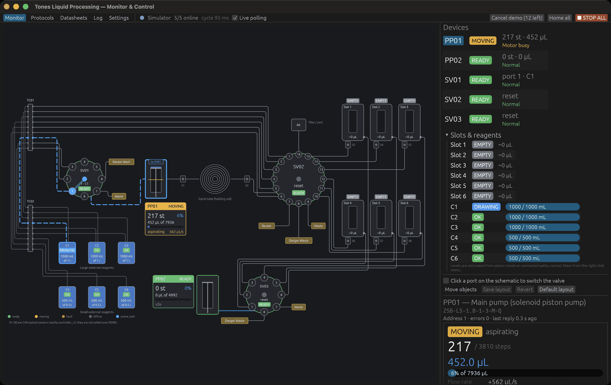
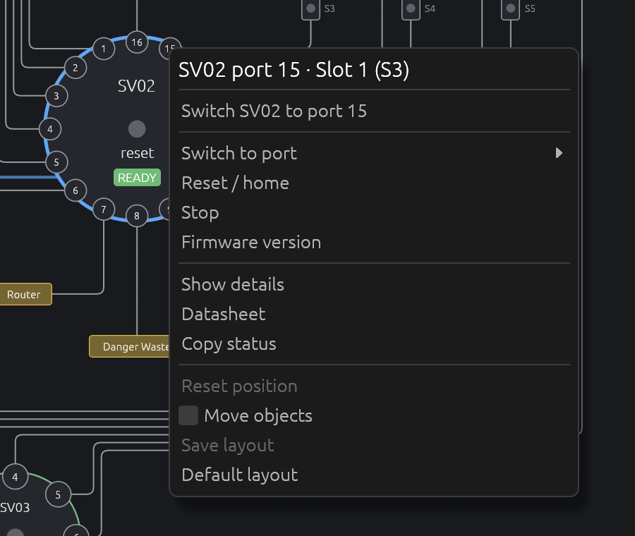

# manual_control_gui

Rust (egui) program to monitor and manually control the Tones liquid processing rig in real time: both piston pumps and all three selector valves, drawn as the fluidic schematic from `Tones_Liqud_Processing.drawio`, plus the `signal_sender` protocol commands for controller_v2.

## Tabs

- **Monitor**: the live schematic. Valve rotors point at the current port, pump barrels fill with piston position, the active flow path is highlighted, and moving dots show which way liquid is going. When PP01 is connected to a reagent port, the highlight continues through TC01, the TC01–TC02 bundle and TC02 to the dip tube, and the bottle's outline lights up. Each pump has a readout card (state, steps, µL, fill %, direction and flow rate, speed, target) and each valve shows its current port and a state badge; the side panel repeats these in large type. Click a device to control it from the side panel: valve port buttons labelled from the diagram; pump target, aspirate/dispense in steps or µL, speed, solenoid direction, home, forced reset and stop. **STOP ALL** is always in the top bar.
  Tubes are routed automatically and kept aligned: they leave each port in the direction it faces, run on evenly spaced parallel lanes, never share a segment, and have rounded corners. Valve port numbering follows the drawio (SV02 counter-clockwise with 16 at the top; SV01/SV03 clockwise with 4 at the top), so reagent ports face TC01, slot ports face the slots and waste ports point down.
  **Slot and bottle states.** Every slot and reagent bottle shows a state badge and an estimated level.
  - **Slots:**
    - FILLING / DRAINING while a pump moves liquid on the slot's path
    - FILL PATH / DRAIN PATH when a valve is set to the slot
    - BUSY or MISSING as reported by controller_v2 `/slot-status`
    - otherwise FILLED / EMPTY
  - **Bottles:** DRAWING / RETURN / LINKED while connected to PP01, otherwise OK, LOW (under 10 %) or EMPTY.
  - **How levels are estimated:** nothing on the rig measures liquid levels. Levels come from piston travel, counted only while the path stays the same between readings. Correct them from the right-click menu (mark a bottle refilled or set its level; mark a slot empty or full). With the RS485 backend, levels are saved to `tstand_levels.json`. The simulator starts full on every run and never writes that file.
  **Right-click** anything on the schematic for a menu that depends on what you clicked:
  - **Valve or port:** switch to that port or pick one from a list, reset, stop.
  - **Pump:** aspirate or dispense a set volume, move to 0–100 %, set speed and solenoid, home, forced reset, stop.
  - **Slot:** select its fill or drain path, or start a protocol for it.
  - **Bottle:** connect it to PP01 through SV01 or SV02.
  - **Waste or router tag:** switch the valve port that feeds it.
  - **Empty canvas:** stop all, home all.

  Every menu can also reset the component's position and save the layout.
  Turn on **Move objects** to drag any component (valves, pumps, coil, sensors, TC blocks, bottles, slots, waste tags) to a new place. Connections re-route as you drag, and positions snap to a 10 px grid on release. **Save layout** writes `tstand_layout.json` next to the executable; **Default layout** restores the drawio arrangement. `--edit-layout` starts in this mode, and `--demo` runs a simulated slot fill and drain.
- **Protocols**: the `signal_sender` workflow in a form. Build a packet (run protocol, robot step, drain, delay…), estimate its time, send it, then pause/resume/abort by task ID. Slot and protocol progress come from `/slot-status` and `/get-protocol-data`.
- **Datasheets**: specs for every part number, the port map for each valve, and the RS485 command and status tables, with links to the Runze sources.
- **Log**: command results and faults. Tick *Raw frames* to see every TX/RX frame in hex.
- **Settings**: backend, port, baud rate, slave addresses, poll rate, pump calibration, controller address, UI scale and schematic label size.

## Screenshots

**Draining slot 1.** PP02 pulls liquid out of slot 1 through SV03 port 6 (active path, flow dots, DRAINING badge). The side panel shows device, slot and reagent states and the selected pump's readout.



**Drawing reagent.** PP01 aspirates from C1 through SV01 port 1. The highlight runs from the pump through TC01, the bundle and TC02 to the bottle, and C1 shows DRAWING.



**Right-click menu on a valve port.**



Pump manufacturer documentation is in [`docs/datasheets/pumps`](docs/datasheets/pumps/README.md).

## Hardware connections

- USB to RS485 adapter (pumps and valves, 9600 8N1 by default)

The S1–S8 optical sensors are on CAN and are read by controller_v2, so this program does not show them.

> **One bus master at a time.** If controller_v2 is running on the same RS485 adapter, stop it before choosing the *RS485 serial* backend here. Otherwise both programs talk on the bus at once and corrupt each other's frames. The *Protocols* tab only uses HTTP and is safe to use alongside controller_v2.

## Building and running

Runs on Windows, macOS and Linux (x86_64 and ARM). Install Rust 1.88 or newer from <https://rustup.rs>, then:

```sh
cargo run --release
```

- **Windows:** the release build is a GUI app with no console window. Serial ports show up as `COM3` and so on; check Device Manager.
- **macOS:** pick the `/dev/cu.usbserial-*` port, not `/dev/tty.*`.
- **Linux:** building needs the X11/Wayland development headers:
  ```sh
  sudo apt install libxkbcommon-dev libwayland-dev libx11-dev libxcursor-dev libxrandr-dev libxi-dev libgl1-mesa-dev
  ```
  To open `/dev/ttyUSB0` without root, add yourself to the `dialout` group (`sudo usermod -aG dialout $USER`, then log in again). No libudev is needed.

### Screens and DPI

- **Display scaling:** the window follows the operating system's display scaling, including per-monitor DPI and moving between screens.
- **Window size:** it opens centered and never bigger than the monitor. The minimum size is 800×520 points, and the side panel width adapts to the window.
- **Zoom:** press Ctrl/Cmd `+`/`-`, or set **Settings → Display → UI scale**. **Schematic label size** scales the readouts on the diagram. Settings also shows the current screen scale.
- **Line thickness:** lines on the schematic never get thinner than one physical pixel.

### Graphics

The default renderer is wgpu: Direct3D 12 or Vulkan on Windows, Metal on macOS, Vulkan or OpenGL on Linux. On virtual machines, remote desktops or old GPUs where it fails to start, use OpenGL instead:

```sh
TSTAND_RENDERER=glow cargo run --release
```

On Windows PowerShell, set it first with `$env:TSTAND_RENDERER="glow"`.

### Where files are stored

`tstand_settings.json`, `tstand_layout_v2.json` and `tstand_levels.json` are kept next to the executable when that folder is writable. Otherwise they go to:
- Windows: `%APPDATA%\TonesLiquidProcessing`
- macOS: `~/Library/Application Support/TonesLiquidProcessing`
- Linux: `~/.config/TonesLiquidProcessing`

### Prebuilt binaries

Every push runs `.github/workflows/build.yml`, which tests and builds release binaries for Windows, macOS (Apple Silicon and Intel) and Linux. The binaries are attached to the workflow run as artifacts.

The program starts with the **Simulator** backend, which needs no hardware and follows datasheet timing. To use real hardware, go to Settings, choose *RS485 serial*, pick the port and click **Apply & save**. It may be necessary to home components before other commands work.

| Device | Role | Part number | Slave ID |
| ------ | ---- | ----------- | -------- |
| PP01 | Main solenoid piston pump | ZSB-LS-1.8-1-3-M-Q | 1 |
| PP02 | Drain piston pump | ZSB08-LS-0.9-1-5-1-Q | 2 |
| SV01 | Reagent / wash selector, 8 port | QHF-SV07-X-S-T08-K1.2-S | 3 |
| SV02 | Main selector, 16 port | QHF-SV07-X-S-T16-K1.0-S | 4 |
| SV03 | Drain selector, 8 port | QHF-SV07-X-S-T08-K1.2-S | 5 |

## Live monitoring

Each poll cycle sends every device a position query (`0x66` for pumps, `0x3E` for valves) and a motor status query (`0x4A`). Commands are queued on the same worker thread, so they never overlap with polling. A device that stops answering is retried every 2 s, so one missing device does not slow the rest.

## Tests

```sh
cargo test
```
