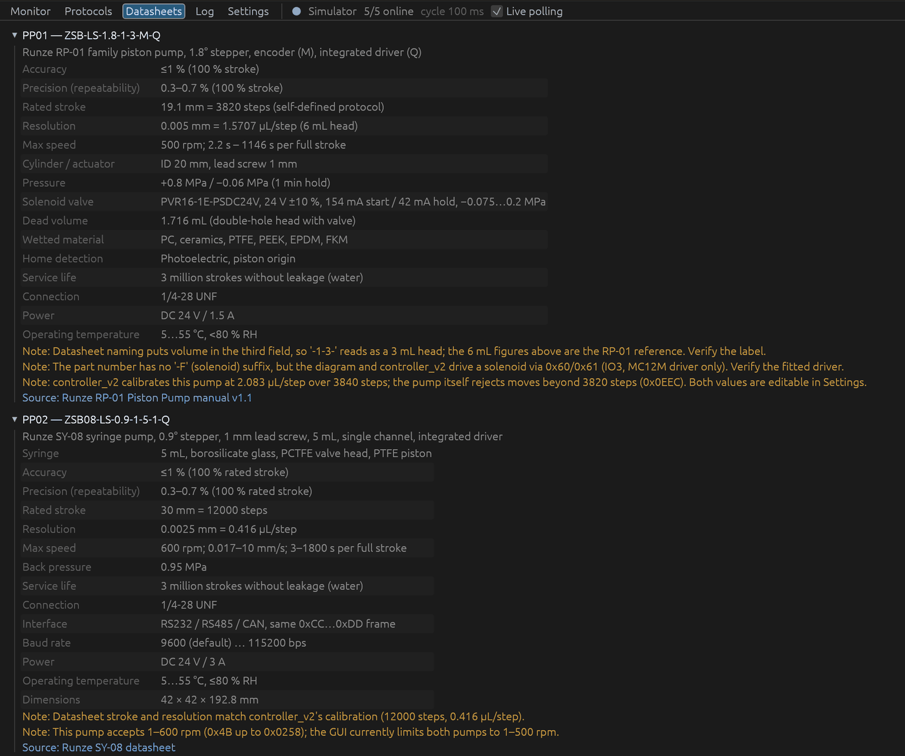

# Pump datasheets

Manufacturer documentation for the two pumps on the Tones liquid processing rig, downloaded from [Runze Fluid](https://www.runzefluid.com/resources/).

| Pump | Part number | Model |
| ---- | ----------- | ----- |
| PP01 — main pump (solenoid piston pump) | ZSB-LS-1.8-1-3-M-Q | Runze RP-01 family piston pump |
| PP02 — drain pump | ZSB08-LS-0.9-1-5-1-Q | Runze SY-08 syringe pump, 5 mL |

The key figures from these documents are also in the GUI's **Datasheets** tab:

## Files

| File | Pump | What it covers | Source |
| ---- | ---- | -------------- | ------ |
| `PP01_Runze_RP-01_Piston_Pump_Manual_v1.1.pdf` | PP01 | Naming rules, solenoid valve, drivers, specs, 0xCC…0xDD command set and status codes | [rp-01-piston-pump-v1-1.pdf](https://www.runzefluid.com/uploads/file/rp-01-piston-pump-v1-1.pdf) |
| `PP01_Runze_RP-01_Piston_Pump_Manual_v1.1_alt.pdf` | PP01 | Same manual version, published separately; a different file from the one above | [rp-01-piston-pump.pdf](https://www.runzefluid.com/uploads/file/rp-01-piston-pump.pdf) |
| `PP02_Runze_SY-08_Datasheet.pdf` | PP02 | Model numbers (confirms `ZSB08-LS-0.9-1-5-1-Q` = 5 mL), specs, dimensions, driver ports | [sy-08.pdf](https://www.runzefluid.com/uploads/file/sy-08.pdf) |
| `PP02_Runze_SY-08_Manual_HEX_protocol_v2.0.pdf` | PP02 | Full manual for the hex (0xCC…0xDD) protocol this project uses | [sy-08-syringe-pump-hex-v2.pdf](https://www.runzefluid.com/uploads/file/sy-08-syringe-pump-hex-v2.pdf) |
| `PP02_Runze_SY-08_Syringe_Pump_Quick_Use_Guide.pdf` | PP02 | Quick start for the hex protocol (6 pages) | [sy-08-runze-quick-use-quide.pdf](https://www.runzefluid.com/uploads/file/sy-08-runze-quick-use-quide.pdf) |
| `PP02_Runze_SY-08_Manual_ASCII_protocol_v1.6.pdf` | PP02 | Full manual for the alternative ASCII protocol | [sy-08-syringe-pump-ascii-v1-6.pdf](https://www.runzefluid.com/uploads/file/sy-08-syringe-pump-ascii-v1-6.pdf) |
| `PP02_Runze_SY-08_ASCII_Quick_Use_Guide.pdf` | PP02 | Quick start for the ASCII protocol (4 pages) | [sy-08-ascii-quick-use-quide.pdf](https://www.runzefluid.com/uploads/file/sy-08-ascii-quick-use-quide.pdf) |
| `PP02_Runze_SY-08_Magnetic_Coding_v1.0.pdf` | PP02 | SY-08 variant with a magnetic encoder (46 pages) | [sy-08-syringe-pump-magnetic-coding-v1-0.pdf](https://www.runzefluid.com/uploads/file/sy-08-syringe-pump-magnetic-coding-v1-0.pdf) |
| `Runze_SY-01B_Syringe_Pump_Manual_v1.0_protocol.pdf` | both | Same 8-byte frame, checksum, command and status tables in another Runze manual | [sy-01b-user's-manual-v1-0.pdf](https://www.runzefluid.com/uploads/file/sy-01b-user's-manual-v1-0.pdf) |
| `Runze_Fluid_Catalogue_v8.23_pumps_and_valves.pdf` | both | Product catalogue with the SY-08 and RP-01 pages (and the SV-07 valves) | [runze-fluid-catalogue-v8.23.pdf](https://www.runzefluid.com/uploads/file/runze-fluid-catalogue-v8.23.pdf) |

The Runze `SerialCommV1.5.0` test tool (`serialcommv1.5.zip`) is also on the resources page. It is software, not documentation, so it isn't included here.

## Notes for this rig

- **PP02 calibration:** the SY-08 datasheet gives a 30 mm stroke of 12000 steps for every syringe size. For the 5 mL syringe that is 0.4167 µL/step, which matches controller_v2's calibration (12000 steps, 0.416 µL/step).
- **PP01 calibration:** by the RP-01 naming rules, `ZSB-LS-1.8-1-3-M-Q` reads as a 3 mL head without a solenoid (`-F`) suffix. The diagram and controller_v2 treat PP01 as having a solenoid, and controller_v2 calibrates it at 2.083 µL/step. Check the label on the pump.
- **Protocol:** both pumps are driven with the hex protocol. Each 8-byte frame is `CC ADDR FUNC P_lo P_hi DD SUM_lo SUM_hi`, with replies in the same format. The GUI implements it in [`src/protocol.rs`](../../../src/protocol.rs).
